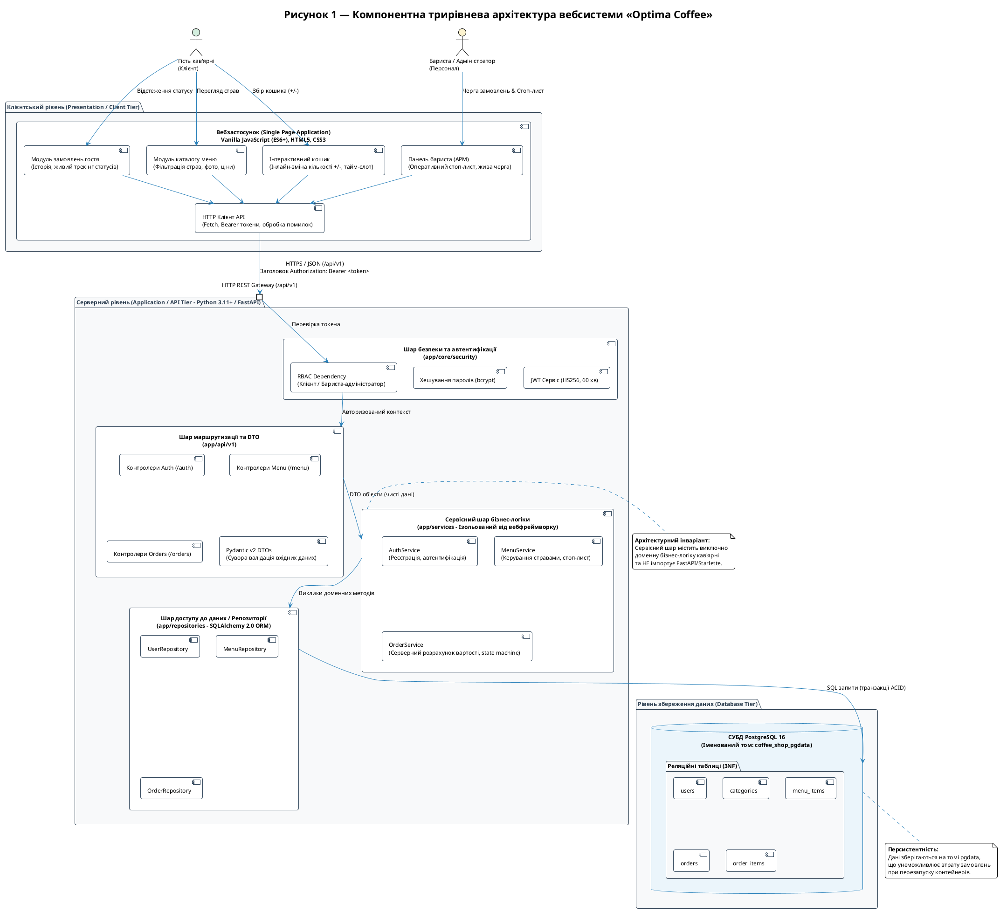
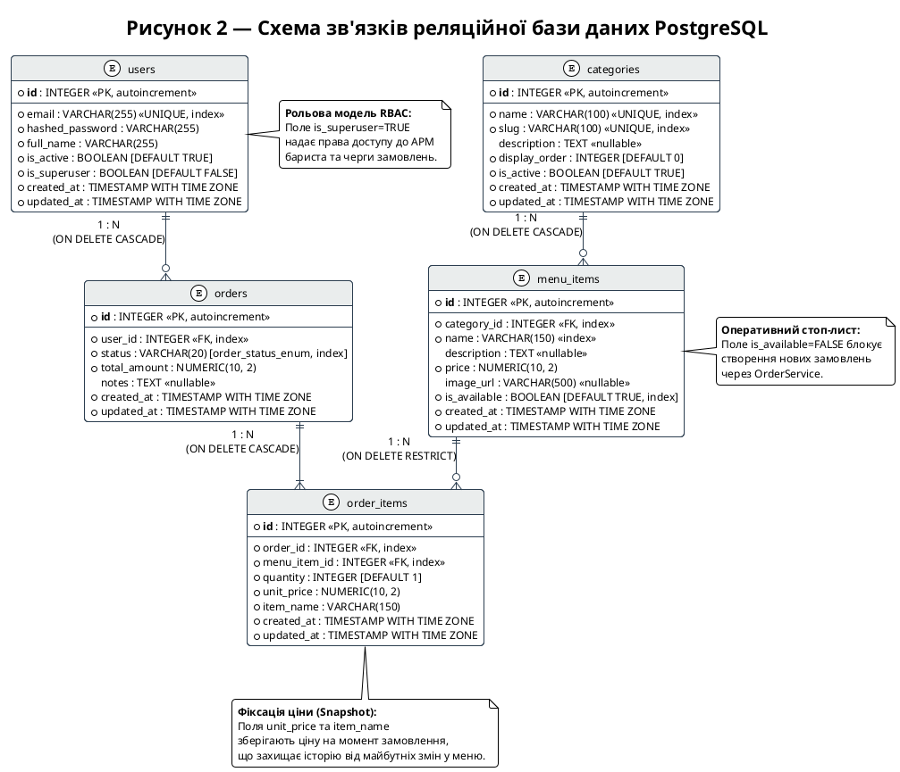

# ГРАФІЧНІ ДІАГРАМИ ПРОЄКТУ (PLANTUML DIAGRAMS)

У цьому документі наведено вихідний код PlantUML (`.puml`) та вичерпний технічний опис для ключових схем вебсистеми онлайн-замовлень кав'ярні «Optima Coffee»:
1. **Рисунок 1 — Компонентна трирівнева архітектура вебсистеми «Optima Coffee»** ([`architecture.puml`](architecture.puml))
2. **Рисунок 2 — Схема зв'язків реляційної бази даних PostgreSQL** ([`database-schema.puml`](database-schema.puml))

---

## 1 Рисунок 1 — Компонентна трирівнева архітектура вебсистеми «Optima Coffee»

### 1.1 Призначення схеми
Діаграма відображає компонентну структуру системи, логічний розподіл обов'язків між фізичними та логічними шарами (трирівнева тришарова архітектура, ADR-0001), ролі користувачів (гість, бариста) та суворо односпрямований потік обробки запитів.

### 1.2 Опис архітектурних шарів та компонентів

1. **Клієнтський рівень (Presentation / Client Tier):**
   - **Технології:** Vanilla JavaScript (ES6+), HTML5, CSS3, односторінковий застосунок (SPA) без використання сторонніх важких фреймворків.
   - **Компоненти:**
     - `Модуль каталогу меню`: фільтрація страв за категоріями, показ фото, описів, цін та алергенів.
     - `Інтерактивний кошик`: збереження стану в браузері, інлайн-зміна кількості `+/-`, вибір тайм-слота самовивозу та побажань до замовлення.
     - `Модуль замовлень гостя`: перегляд історії замовлень клієнта та моніторинг стадій приготування напою.
     - `Панель бариста (АРМ)`: робоче місце персоналу з оперативним перемикачем стоп-листа страв та живою диспетчеризацією черги замовлень.
     - `HTTP Клієнт API`: модуль ізольованої взаємодії через Fetch API, автоматичне додавання токенів `Bearer` та централізована обробка помилок.

2. **Серверний рівень (Application / API Tier - FastAPI):**
   - **Технології:** Python 3.11+, вебфреймворк FastAPI, валідація Pydantic v2, асинхронний сервер Uvicorn.
   - **Шар безпеки (app/core/security):**
     - `JWT Сервіс`: генерація та верифікація токенів доступу (алгоритм HS256, строк дії 60 хвилин).
     - `Хешування паролів`: криптографічний алгоритм `bcrypt` із автоматичною генерацією випадкової солі.
     - `RBAC Dependency`: перевірка ролей (`is_superuser`) для захисту адміністративних ендпоїнтів та черги бариста.
   - **Шар маршрутизації (app/api/v1):**
     - Контролери ендпоїнтів `/auth`, `/menu`, `/orders`.
     - Автоматична валідація схем DTO (Pydantic v2) та генерація специфікації OpenAPI 3.1.
   - **Сервісний шар (app/services):**
     - **Архітектурний інваріант:** чиста доменна бізнес-логіка, повна ізоляція від коду вебфреймворку (жодних імпортів із `fastapi` чи `starlette`).
     - Відповідає за перевірку доступності страв у стоп-листі, серверний розрахунок вартості замовлення та валідацію переходів статусів замовлення (`pending` → `confirmed` → `ready` → `completed` / `cancelled`).
   - **Шар доступу до даних / Репозиторії (app/repositories):**
     - Інкапсуляція операцій SQLAlchemy 2.0 ORM; єдине місце в системі, де формуються та виконуються запити до бази даних.

3. **Рівень збереження даних (Database Tier):**
   - **Технології:** СУБД PostgreSQL 16 у виділеному OCI-контейнері.
   - **Персистентність:** дані зберігаються на іменованому томі `coffee_shop_pgdata`, що гарантує збереження бази при оновленні контейнерів.

### 1.3 Вихідний код PlantUML ([`docs/architecture.puml`](architecture.puml))



---

## 2 Рисунок 2 — Схема зв'язків реляційної бази даних PostgreSQL

### 2.1 Призначення схеми
ER-діаграма описує структуру реляційної бази даних системи «Optima Coffee», нормалізованої до третьої нормальної форми (3NF), типи стовпців, первинні (PK) та зовнішні (FK) ключі, індекси, обмеження цілісності та правила каскадного оновлення/видалення даних.

### 2.2 Опис сутностей та реляційних зв'язків

1. **Сутність `users` (Користувачі системи):**
   - Зберігає облікові записи гостей та персоналу.
   - Атрибут `email` захищений індексом унікальності (`UNIQUE`).
   - Пароль зберігається виключно як криптографічний хеш (`hashed_password`, алгоритм bcrypt).
   - Атрибут `is_superuser` визначає роль користувача в рамках моделі RBAC (значення `TRUE` надає доступ до панелі бариста).
   - Атрибути `created_at` та `updated_at` додаються через `TimestampMixin`.

2. **Сутність `categories` (Категорії меню):**
   - Класифікує асортимент кав'ярні (наприклад, «Кава», «Чай», «Десерти», «Сендвічі»).
   - Має унікальний ідентифікатор `slug` для зручної URL-фільтрації на клієнті.
   - Поле `display_order` регулює послідовність відображення вкладок у меню.

3. **Сутність `menu_items` (Позиції меню):**
   - Містить інформацію про конкретні напої чи страви.
   - Зв'язок із таблицею категорій: `category_id` (зовнішній ключ, відношення «багато-до-одного»). При видаленні категорії пов'язані страви видаляються каскадно (`ON DELETE CASCADE`).
   - Поле `is_available` є основою оперативного стоп-листа: бариста може вимкнути страву в один клік, після чого серверний шар блокує додавання цієї позиції до нових замовлень.
   - Ціна `price` зберігається у високоточному форматі `NUMERIC(10, 2)` для уникнення похибок округлення чисел з рухомою комою.

4. **Сутність `orders` (Замовлення):**
   - Фіксує транзакцію попереднього замовлення.
   - Зв'язок із користувачем: `user_id` (зовнішній ключ, `ON DELETE CASCADE`).
   - Статус замовлення `status` типізований через перелік `OrderStatus` зі строго дозволеними переходами станів:
     `pending` (очікує) → `confirmed` (прийнято в роботу) → `ready` (готове до видачі) → `completed` (видано гостю) або `cancelled` (скасовано).
   - Поле `total_amount` розраховується виключно бекендом під час створення замовлення.

5. **Сутність `order_items` (Позиції у складі замовлення):**
   - Зв'язує замовлення зі стравами (асоціативна таблиця зв'язку «багато-до-багатьох»).
   - Зв'язок із замовленням: `order_id` (`ON DELETE CASCADE`).
   - Зв'язок із меню: `menu_item_id` (`ON DELETE RESTRICT`) — запобігає випадковому видаленню страви з каталогу, якщо вона вже присутня в історії замовлень.
   - **Важливий патерн збереження знімку (Snapshot):** поля `item_name` та `unit_price` фіксують назву та вартість страви безпосередньо на момент купівлі. Навіть якщо ціна страви в каталозі зміниться в майбутньому, звітність за старими замовленнями залишатиметься фінансово точною.

### 2.3 Вихідний код PlantUML ([`docs/database-schema.puml`](database-schema.puml))



---

## 3 Як згенерувати графічні зображення діаграм

Файли `.puml` є вихідним текстовим описом на мові PlantUML. Для їх експорту у растрові (`.png`) або векторні (`.svg`) зображення можна скористатися одним із таких методів:

1. **Через вебсервер PlantUML (без встановлення ПЗ):**
   - Відкрийте офіційний онлайн-редактор [www.plantuml.com/plantuml](http://www.plantuml.com/plantuml).
   - Скопіюйте вміст файлу `docs/architecture.puml` або `docs/database-schema.puml` у текстове поле.
   - Завантажте згенероване зображення у форматі PNG або SVG.

2. **Через середовища розробки VS Code або JetBrains:**
   - Встановіть плагін **PlantUML** (для VS Code: розширення від Jebbs).
   - Відкрийте файл `.puml` та натисніть `Alt+D` (або `Option+D` на macOS) для інтерактивного попереднього перегляду.
   - Натисніть правою кнопкою миші на попередньому перегляді → *Export Current Diagram* → обрати PNG/SVG.

3. **Через командний рядок (CLI PlantUML за наявності Java):**
   ```bash
   plantuml -tpng project/docs/architecture.puml
   plantuml -tpng project/docs/database-schema.puml
   ```
   У результаті буде створено файли `architecture.png` та `database-schema.png`.
